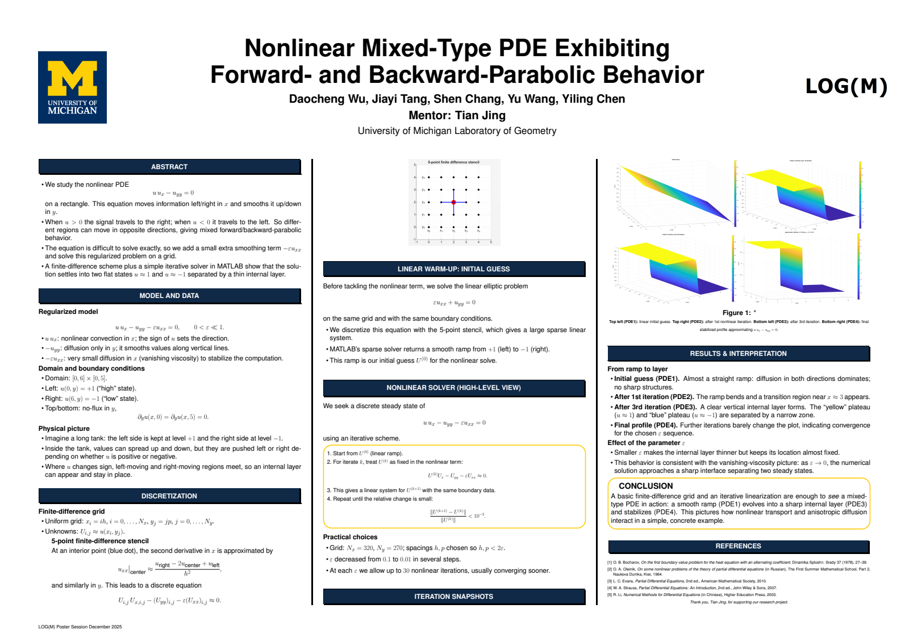

# Nonlinear Mixed-Type PDE

**Scientific computing · Numerical analysis · MATLAB**

How can nonlinear transport create a sharp internal layer from a smooth initial profile? This research project studies a forward/backward-parabolic equation using vanishing-viscosity regularization, finite differences, and sparse iterative solves.

$$u\,u_x-u_{yy}=0 \quad\longrightarrow\quad u\,u_x-u_{yy}-\varepsilon u_{xx}=0,\qquad \varepsilon>0.$$

[Research poster](docs/research-poster.pdf) · [Numerical method](docs/method.md) · [Code audit and validation](docs/validation.md)



## Project at a glance

| Question | Approach |
|---|---|
| How does the sign of the solution affect the unregularized equation? | Study regions with forward- and backward-parabolic behavior when treating x as an evolution variable. |
| How can a numerical steady state be computed? | Add positive x diffusion, discretize on a rectangular grid, and freeze the nonlinear advection coefficient in a Picard iteration. |
| What does the original poster report? | A smooth ramp evolves into plateaus near +1 and −1 separated by a narrow layer near x = 3; smaller viscosity sharpens the layer. |
| What does this repository add? | A documented solver, corrected boundary treatment, a runnable demo, manufactured-solution tests, and preserved original research scripts. |

The original experiment uses the domain **[0, 6] × [0, 5]**, left/right values **+1/−1**, and homogeneous vertical Neumann conditions. The poster's observations are historical research results; they are not presented as newly reproduced MATLAB results.

## Run the MATLAB demo

From the repository root in MATLAB:

```matlab
run('examples/demo_internal_layer.m')
```

The example uses 121 × 31 physical grid points and viscosity continuation through 0.2, 0.1, and 0.05. It plots the final surface and centerline profiles. It requires base MATLAB; no data downloads or toolboxes are needed.

```matlab
addpath('tests')
run_tests
```

Tests cover zero boundary data, nonzero Neumann derivatives, a known manufactured solution, second-order grid refinement, invalid inputs, and explicit nonconvergence. A warning is expected for the intentional one-iteration nonconvergence test.

**Execution status:** MATLAB and Octave were unavailable during packaging. The `.m` files were reviewed but not executed. An independent Python/SciPy calculation verified the discretization with refinement orders **2.008** and **2.002**; it does not certify MATLAB runtime compatibility. See [validation evidence](docs/validation.md).

## Use the solver

```matlab
addpath('src')
x = linspace(0,6,121);
y = linspace(0,5,31);
bc.left = ones(numel(y),1);
bc.right = -ones(numel(y),1);
bc.bottom = zeros(1,numel(x));
bc.top = zeros(1,numel(x));
[U, info] = solve_nonlinear_pde(0.1, x, y, bc);
assert(info.converged, info.status)
```

`U(j,i)` corresponds to `(x(i),y(j))`. Both horizontal boundary arrays specify **du/dy in the positive y direction**, rather than outward-normal flux. The API also accepts a source term and a warm start for manufactured-solution checks and parameter continuation.

## Repository map

```text
src/solve_nonlinear_pde.m    Revised sparse finite-difference solver
examples/                  Self-contained internal-layer demo
tests/                     MATLAB tests and independent Python reference check
docs/                      Poster, method, code audit, validation evidence
assets/                    Preview of the original poster
archive/original/          Original MATLAB files, preserved byte for byte
```

## Scope and interpretation

This is a research demonstration of a regularized steady equation. Finite viscosity changes the PDE into an elliptic problem; no proof of convergence to the unregularized mixed-type equation is claimed. Centered advection can oscillate if the x grid does not resolve the viscosity scale. The solver reports residuals, convergence status, and a cell Peclet diagnostic so a visually smooth plot is not the only quality check.

The symmetric, y-independent boundary data naturally admit a y-independent profile. The displayed layer does not by itself demonstrate general two-dimensional behavior or uniqueness.

## Research credits

**Daocheng Wu, Jiayi Tang, Shen Chang, Yu Wang, and Yiling Chen**  
Mentor: **Tian Jing**  
University of Michigan Laboratory of Geometry / **LOG(M), December 2025**

Names and affiliation follow the supplied poster. This is a collaborative project; individual contributions are not inferred. The original scripts and poster are archived separately from the later repository preparation and corrected implementation. No new license is assigned to the team's original materials.
